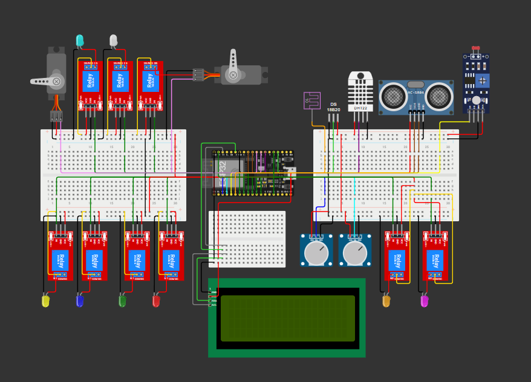

# 🌱 Agri-Hub: Smart Hydroponics & Agricultural Automation System


**Agri-Hub** adalah sistem pemantauan dan otomatisasi hidroponik/pertanian berbasis **IoT (Internet of Things)** berbasis ESP32. Sistem ini dirancang untuk mengontrol nutrisi, derajat keasaman (pH), mikroiklim (suhu/kelembapan), pencahayaan, serta debit air secara otomatis. 

Dilengkapi dengan sistem **Proteksi Kegagalan (Failsafe)**, pemrosesan **Non-Blocking (`millis()`)**, pemantauan lokal via **LCD 20x4 I2C**, dan telemetri data jarak jauh via **EMQX MQTT Broker**.

*🔗 Repo AI:* https://github.com/gadicandra/pakcoy-brief

---

## 📸 Tampilan Sistem



---

## ✨ Fitur Utama

- **Otomatisasi Nutrisi & pH Air:** Pengontrolan otomatis larutan nutrisi (PPM) dan pengkondisian pH (pH Up / pH Down).
- **Pengkondisian Mikroiklim:** Kontrol otomatis *Mist Sprayer*, Kipas Udara, Kipas Tandon, *Grow Light*, dan Servo Paranet berdasarkan intensitas cahaya (Lux), suhu, dan kelembapan.
- **Sistem Proteksi Failsafe:**
  - *Overfill & Sensor Error Protection:* Solenoid valve otomatis mati jika sensor ultrasonik error atau tandon air sudah penuh.
  - *Pump Anomaly Detection:* Mendeteksi jika terjadi kemacetan pada pompa utama berdasarkan pembacaan debit *Water Flow Sensor*.
- **Multitasking Non-Blocking:** Menggunakan pewaktuan `millis()`, sehingga sistem tidak membeku (*freeze*) ketika WiFi/MQTT terputus.
- **Layar Lokal Rotatif (LCD 20x4 I2C):** Menampilkan data sensor, status aktuator, dan kondisi sistem secara bergiliran setiap 3–5 detik.
- **Komunikasi Cloud Terenkripsi:** Menggunakan **MQTT over TLS/SSL (Port 8883)** dengan payload format **JSON**.

---

## 📌 Pemetaan Pin ESP32 (Hardware Wiring)

Semua pin telah dioptimalkan untuk menghindari konflik *Strapping Pins* (seperti GPIO 12 / GPIO 2) untuk mencegah kecacatan *boot-loop* pada ESP32.

### 1. Sensor (Input)
| Sensor | Tipe Data | Pin ESP32 | Keterangan |
| :--- | :--- | :--- | :--- |
| **DHT22** | Digital | `GPIO 4` | Suhu & Kelembapan Udara |
| **DS18B20** | OneWire | `GPIO 15` | Suhu Air Tandon |
| **HC-SR04 (Ultrasonik)** | Digital | `GPIO 5` (Trig), `GPIO 18` (Echo) | Ketinggian / Jarak Air Tandon |
| **Water Flow Sensor** | Interrupt | `GPIO 35` | Input-Only (Bebas Konflik Boot) |
| **TDS Meter** | Analog | `GPIO 36` (VP) | Kadar Nutrisi Air |
| **pH Meter** | Analog | `GPIO 39` (VN) | Keasaman Air |
| **LDR Sensor** | Analog | `GPIO 34` | Intensitas Cahaya |

### 2. Aktuator Relay (Output)
| Aktuator | Pin ESP32 | Kondisi Terpicu |
| :--- | :--- | :--- |
| **Pompa Utama** | `GPIO 13` | Relay 1 |
| **Pompa pH Up** | `GPIO 14` | Relay 2 |
| **Pompa pH Down** | `GPIO 19` | Relay 3 |
| **Pompa Nutrisi** | `GPIO 23` | Relay 4 |
| **Kipas Luar / Exhaust** | `GPIO 25` | Relay 5 |
| **Kipas Tandon** | `GPIO 26` | Relay 6 |
| **Mist Sprayer** | `GPIO 27` | Relay 7 |
| **Solenoid Valve** | `GPIO 32` | Relay 8 |
| **Grow Light** | `GPIO 33` | Relay 9 |

### 3. Servo & Tampilan
| Komponen | Pin ESP32 | Keterangan |
| :--- | :--- | :--- |
| **Servo Pompa** | `GPIO 16` | Kontrol katup mekanis pompa |
| **Servo Paranet** | `GPIO 17` | Buka/Tutup atap peneduh |
| **LCD 20x4 I2C** | `GPIO 21` (SDA), `GPIO 22` (SCL) | Jalur Bus I2C Utama |

---

## 📡 Topik MQTT & Struktur Data JSON

Sistem terhubung ke Broker MQTT dan mempublikasikan data secara periodik (setiap 5 menit) atau *event-driven* (saat terjadi alert darurat).

### 1. Topic: `agri-hub/sensor` (Publish)
```json
{
  "time": 630,
  "suhu_udara": 29.5,
  "kelembapan_udara": 75.0,
  "suhu_air": 26.2,
  "ppm": 1050,
  "ph_air": 6.2,
  "intensitas_cahaya": 3500,
  "jarak_ke_air": 45.0,
  "debit_air": 12.5
}
```

### 2. Topic: `agri-hub/aktuator` (Publish)
```json
{
  "time": 630,
  "pompa_utama": "ON",
  "pompa_ph_up": "OFF",
  "pompa_ph_down": "OFF",
  "pompa_nutrisi": "OFF",
  "kipas_luar": "OFF",
  "kipas_tandon": "OFF",
  "mist_sprayer": "ON",
  "solenoid_valve": "OFF",
  "grow_light": "OFF",
  "paranet": "TERBUKA"
}
```

### 3. Topic: `agri-hub/status` (Publish)
```json
{
  "status_pompa_utama": "NORMAL",
  "status_tandon": "NORMAL"
}
```

---

## 🛠️ Persiapan & Instalasi

### 1. Library Arduino IDE
Pastikan Anda telah menginstal pustaka berikut via **Arduino Library Manager**:
- `PubSubClient` (oleh Nick O'Leary)
- `ArduinoJson` (oleh Benoit Blanchon)
- `DHT sensor library` (oleh Adafruit)
- `DallasTemperature` & `OneWire`
- `ESP32Servo` (oleh Kevin Harrington)
- `LiquidCrystal_I2C` (oleh Frank de Brabander)

### 2. Konfigurasi Kode
Buka berkas utama `.ino`, lalu sesuaikan kredensial WiFi dan broker MQTT Anda:
```cpp
const char* ssid        = "NAMA_WIFI_ANDA";
const char* password    = "PASSWORD_WIFI_ANDA";
const char* mqtt_server = "SERVER_MQTT_EMQX";
const char* mqtt_user   = "USERNAME_MQTT";
const char* mqtt_pass   = "PASSWORD_MQTT";
```

### 3. Upload Program
1. Pilih Board: **ESP32 Dev Module**.
2. Pilih Port COM yang sesuai.
3. Tekan tombol **Upload**.

---

## 📄 Lisensi

Proyek ini dilisensikan di bawah **MIT License** - bebas digunakan, dimodifikasi, dan didistribusikan untuk keperluan edukasi maupun komersial.

---

**Dikembangkan untuk Bootcamp TETI 2026.**  
*Jika proyek ini bermanfaat, berikan bintang ⭐️ pada repositori ini!*
